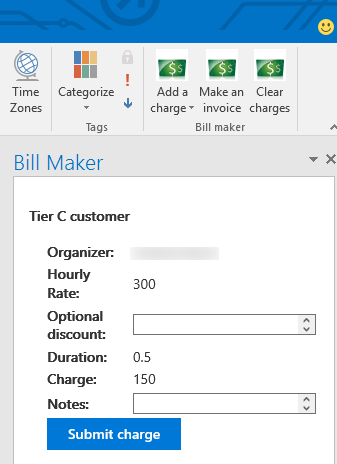

# Microsoft Outlook-Add-in-BillMaker
This Outlook add-in demonstrates how to implement three types of command buttons: a button with a drop-down menu (each of which launches a task pane), a button that launches a task pane, and a button that runs a function that uses no task pane UI. The app appears when you open an existing appointment or meeting and allows you to create and send invoices to clients with whom you've met. This sample currently runs only with the Outlook 2016 desktop client.

The **Add a charge button** contains a three-option drop-down menu that allows you to apply charges for three different tiers of customers. The **Make an invoice** button generates an invoice out of all of the saved charges, and the **Clear changes** button clears all charges for the current customer.

## Prerequisites
* [npm](https://www.npmjs.com/), Node Package Manager, is required to install dev dependencies.
* [Bower](http://bower.io/) is required to install front-end dependencies. 
* [Gulp](http://gulpjs.com/) is used as a task runner, including serving the application on a development server.
* An Office 365 account. If you don't have one, [join the Office 365 Developer Program and get a free 1 year subscription to Office 365](https://aka.ms/devprogramsignup).

## Configure the add-in
1. Clone this repository.
2. Run `npm install` from your local repository to install both npm and Bower dependencies.
3. Run `gulp serve-static` from your local repository to start development server.
4. Go to [mail.office365.com](http://mail.office365.com) and sign in with your Microsoft Office 365 account.
5. Click the gear icon for the Settings menu on the nav bar, and then choose *Manage add-ins*.
6. Click the plus (+) icon, and then choose *Add from a file*.
7. Browse to this repository folder and choose *manifest.xml*.
8. Then complete the wizard (*Next*, *Install*, *OK*) to make the add-in available on your Office 365 account.
9. Finally, you'll have to open the [app](https://localhost:8443/appread/home/home.html) in a browser and trust the certificate for `localhost:8443`. The add-in won't run if your computer doesn't trust it.

## Run the add-in
1. After installing the add-in, open the Outlook 2016 client desktop application. 
2. Choose a calendar meeting.
3. You'll be able to add charges and make invoices for the person who created the meeting.

## Questions and comments
We'd love to get your feedback about this sample. You can send your questions and suggestions to us in the [Issues](https://github.com/OfficeDev/Outlook-Add-in-RepoReport/issues) section of this repository.

## Additional resources
* [Yeoman generator](https://github.com/OfficeDev/generator-office) - Yeoman generator for building Microsoft Office-related projects (including add-ins). This project was built using it.
* [Office UI Fabric](https://github.com/OfficeDev/Office-UI-Fabric/) - The front-end framework for building experiences for Office 365. This project uses it to get an Office "look and feel." 
* [dev.office.com](http://dev.office.com) - Find documentation, samples, and other helpful information relevant to Office development.

## Copyright
Copyright (c) 2015 Microsoft. All rights reserved.

